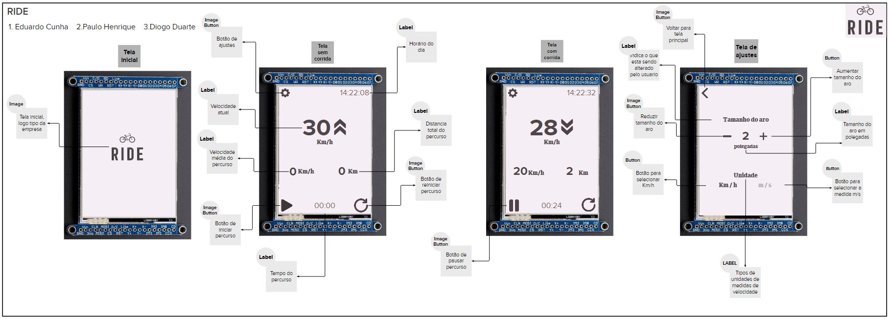
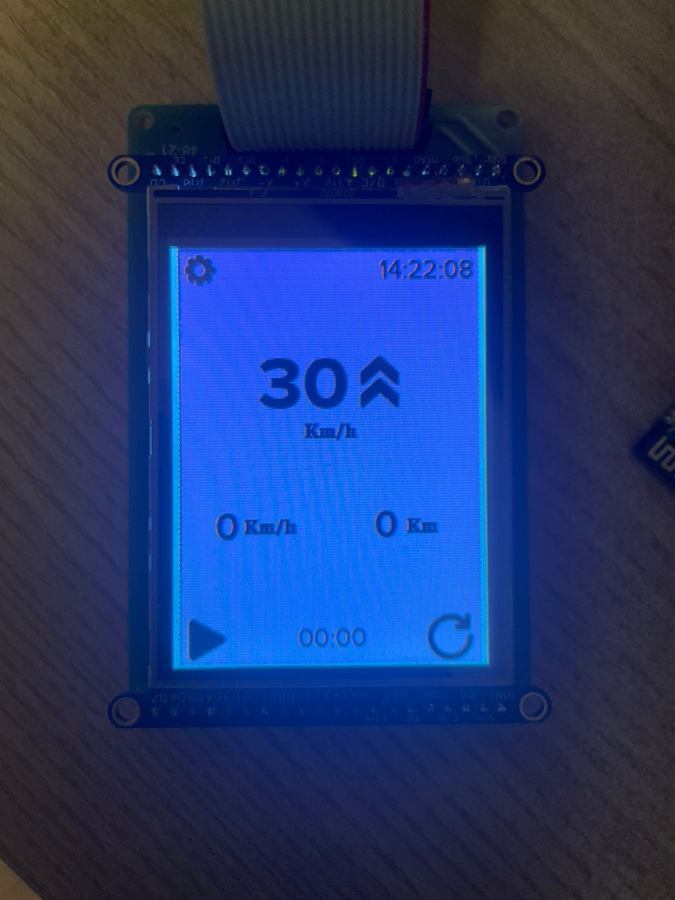

# 21b - APS2 - Embarcados

O marketing de uma empresa de equipamentos esportivos quer criar um novo ciclocomputador e você foi escolhido como desenvolvedor autônomo, dado seu background técnico e de UX, para criar um protótipo e validar a ideia.

Mais detalhes no site da disciplina:

- https://insper.github.io/ComputacaoEmbarcada/navigation/APS/APS-2-Bike/Descricao/

## Detalhes

Integrantes:
- Diogo Duarte
- Eduardo Araujo Rodrigues da Cunha 
- Paulo Henrique Falcão

**Nome da marca: RIDE**

**Logo:**

## Fonte e cores

A fonte a ser utilizada é a *Noto Sans*, nós escolhemos ela pois é um fonte Sans-seriff que facilita a leitura, aspecto crucial para um aplicativo de rápido uso como é o caso do ciclomotor, os contornos não são muito rebuscados e a fonte é de fácil interpretação, além de que possui um aspecto moderno que condiz com o aplicativo.

Já a paleta de cores, foi gerada com base na logo escolhida, de forma a ter uma cor contrastante com as demais, para facilitar e agilizar a leitura da informação, principalmente, pensando que o Sol estará incindindo sobre a tela constantemente.

Paleta:

#f5eef4

#4f4649

#785e62

#a1777b

#ca9094

## Interface

### Proposta UX 1 - C

> - Mockup da interface:
>    - Satisfaz todos os requisitos do projeto
>    - Indica quais são os widgets do LVGL 
>    - Apresentar uma foto da interface sendo executada no LCD (imagem estática)
> - Grava um vídeo explicando a interface

Descricão da primeira proposta da interface:

- Imagem da proposta

- Imagem da proposta no LCD

- Vídeo explicando a interface

### Proposta UX 2 - B

> - Especifica e justifica quais vão ser as fontes (e tamanhos) a serem usadas na interface.
> - Pega feedback com o Luiz do Fablab e incorpora na interface
>   - Grava em vídeo a entrevista
> - Grava um vídeo atualizado explicando o que foi sugerido e o que fizeram para melhorar a interface
> - Apresentar uma foto da interface sendo executada no LCD (imagem estática)

Detalhes da segunda interação da proposta de interface:

<!-- 
 Adicionar texto descrevendo a evolução 
 da interface
-->

Foi recomendado que mudassemos a forma que o usuário altera o tamanho do aro de sua bicicleta, ao invés de incrementar ou decrescer polegadas manualmente, existe uma lista de tamanhos pré estabelecidos em um drop-down list. Por fim, na seleção da unidade utilizada pelo usúario, foi recomendado a mudança de metros para milhas.

- Imagem da proposta

- Imagem da proposta no LCD

- Vídeo

### Proposta UX 3 - A

> - Especifica e justifica as cores a serem usadas na interface
> - Pega feedback com mais uma pessoa externa e incorpora na interface
>     - Grava em vídeo a entrevista
> - Grava um vídeo atualizado explicando o que foi sugerido e o que fizeram para melhorar a interface
> - Apresentar uma foto da interface sendo executada no LCD (imagem estática)

Detalhes da terceira interação da proposta de interface:

Nenhuma mudança foi recomendada, a entrevistada ficou satisfeita com a interface vista.

- Imagem da proposta

- Imagem da proposta no LCD

- Vídeo 
